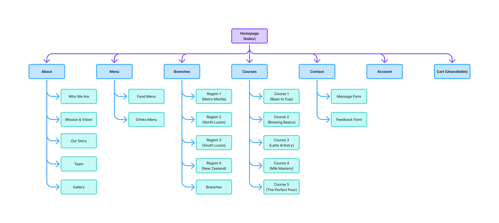

# Kia Ora Cafe Website

A comprehensive, fully responsive website for Kia Ora Cafe - a fictional coffee shop chain that brings the authentic taste and culture of New Zealand to the Philippines. This project represents a complete web development solution showcasing modern frontend techniques, responsive design principles, and interactive user experiences.

The website tells the story of Kia Ora Cafe, founded by Jasmine Sison Taboy, featuring 11 branches nationwide with a unique blend of Kiwi coffee culture and Filipino hospitality. Designed with a warm, nature-inspired aesthetic, the site provides visitors with an immersive digital experience that reflects the cafe's mission of creating community spaces where cultures connect over exceptional coffee.

## 🌟 Features

-   **Fully Responsive Design** - Seamless experience across all devices and screen sizes
-   **Interactive Navigation** - Smooth scrolling and dropdown menus with hover effects
-   **Branch Information** - Detailed accordion layout showcasing 11 locations
-   **Digital Menu** - Categorized food and beverage menu in form of table
-   **Coffee Course Listings** - Workshop descriptions with pricing and details
-   **Contact Forms** - Client-side validation with Bootstrap 5
-   **Interactive Gallery** - Masonry-style layout with hover effects
-   **Photobooth Feature** - Canvas-based photo capture functionality
-   **Newsletter Signup** - Email subscription with validation
-   **Accessibility Focused** - Semantic HTML and keyboard navigation support

## 🚀 Live Demo

[View Live Website](https://d-ustindwayne.github.io/kia-ora-cafe)

## 🛠️ Built With

-   **Frontend:** HTML5, CSS3, Vanilla JavaScript
-   **Framework:** Bootstrap 5.3.0

## 📁 Project Structure & Sitemap

Kia Ora Cafe/  
├── index.html  
├── about.html  
├── branches.html  
├── menu.html  
├── menu-food.html  
├── menu-drinks.html  
├── courses.html  
├── contact.html  
├── account.html  
├── loading.html  
├── 404.html  
├── components/  
├── css/  
├── files/  
├── images/  
│ ├── about/  
│ ├── branches/  
│ ├── courses/  
│ ├── featured/  
│ ├── feedbacks/  
│ ├── gallery/  
│ ├── kia-ora-cafe-icons/  
│ └── menu  
├── js/  
└── videos/  

## 🎯 Pages Overview

Page

Description

**Home**

Landing page with hero section, featured content, and call-to-actions

**About**

Company story, mission/vision, team information, and brand values, and gallery with photobooth feature

**Branches**

11 locations with detailed information in oaccordion layout

**Menu**

Main menu page with navigation to food and drinks sections

**Menu Food**

Table of food menu with categories

**Menu Drinks**

Table of drinks menu with categories

**Courses**

Coffee workshop offerings with details and pricing

**Contact**

Contact forms, location details, and business information

**Account**

User authentication interface (frontend presentation)

## 📄 Documentation

-   **[Consent Form for Jasmine](files/ProjectConsentForm.pdf)** - Project inspiration and concept approval
-   **[Development Log](files/WorkDiary.xlsx)** - Activity log spreadsheet of the entire development phase
-   **[Fit Criteria Checklist](files/Requirements%20Checklist.docx)** - Project criteria for the course
-   **[Development Documentation](files/DevelopmentDocumentation.pdf)** - Technical specifications and development process
-   **[Guide Documentation](files/UserGuide.pdf)** - User and maintenance guides

## 📞 Contact

**Developer:** [Dustin Dwayne Diaz](https://github.com/d-ustindwayne/)  
**Email:** [nepomucenodwayne@gmail.com](mailto:nepomucenodwayne@gmail.com)  
**Project Link:** [https://github.com/d-ustindwayne/kia-ora-cafe-website](https://github.com/d-ustindwayne/kia-ora-cafe-website)

## 🙏 Acknowledgments & References

This project incorporates ideas, code snippets, and resources from various open-source communities and platforms:

-   **Logo and Image Design:** Created using [Canva](https://www.canva.com)
-   **Image Processing:** [Photoroom](https://www.photoroom.com/) for background removal
-   **Image Optimization:** [Trimmy.io](https://trimmy.io) for excess trimming
-   **Favicon Generation:** [Favicon.io](https://favicon.io/favicon-converter/)
-   **Code References:**
    -   XMLHTTP implementation from [W3Schools](https://www.w3schools.com/xml/xml_http.asp)
    -   Anchor link offset solution from [StackOverflow](https://stackoverflow.com/questions/17534661/make-anchor-link-go-some-pixels-above-where-its-linked-to)
    -   Star rating component inspired by [CodePen](https://codepen.io/TND/pen/dRLQmV)
    -   Page reload alert technique from [StackOverflow](https://stackoverflow.com/questions/17986198/how-to-show-an-alert-after-reloading-the-page-in-javascript)
    -   Bootstrap Modal Function without jQuery [StackOverflow](https://stackoverflow.com/questions/58921205/how-do-i-call-bootstrap-modal-functions-without-jquery)
-   **Creative Inspiration:**
    -   Photobooth concept from [Medium article](https://medium.com/@peterchic/deeper-and-deeper-10acdd022598)
    -   Card flip animation from [W3Schools](https://www.w3schools.com/howto/howto_css_flip_card.asp)
-   **Media Assets:**
    -   Custom photos generated from [Leonardo.ai](https://leonardo.ai), [Reve](https://app.reve.com), and [Gemini](https://gemini.google.com)
    -   Free photo video content from [Pexels](https://www.pexels.com)
    -   Free icons content from [Flaticon](https://www.flaticon.com)

Special thanks to ***Jasmine Sison Taboy*** for the inspiring coffee shop concept that formed the foundation of this project.

---

Made with ❤️ and ☕ by Dustin Dwayne Diaz